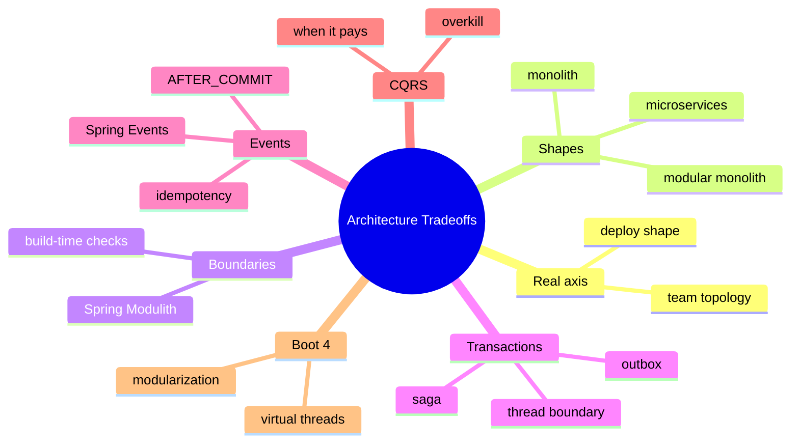
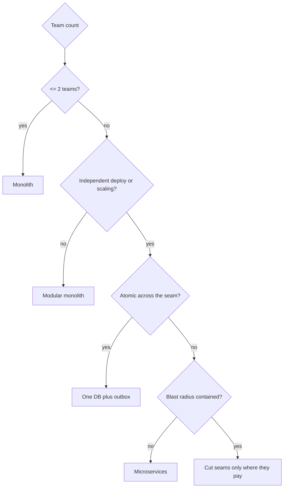

# Module 17: Architecture Tradeoffs

Est. study time: 1.5h
Language: en
Description: Monolith vs modular vs services, Spring Modulith, outbox, CQRS thresholds.

## Knowledge Map



---

## Learning Objectives
- Explain why deploy shape and team topology, not code size, drive monolith-versus-services choice
- Describe the modular monolith and the boundaries Spring Modulith enforces in one deploy
- Locate transaction boundaries and apply outbox or saga when work must cross them
- Compare Spring Events with direct calls and brokers using AFTER_COMMIT and idempotency
- Decide when CQRS pays and how Boot 4 modularization plus virtual threads shift the calculus

---

## Real-World Example

Your e-commerce backend ran as one order service: checkout reserved stock, charged a card, confirmed the order — one `@Transactional` method, one database, one rollback. Executives heard "microservices scale," and a team, "for ownership," split orders, payments, and inventory apart.

The bill arrived at checkout. `placeOrder()` calls `paymentClient.charge()` over HTTP; the caller's transaction ends at the network boundary, so stock, payment, and order commit in three separate transactions. A declined card after reservation cannot roll back inventory — the team hand-writes compensating refunds and reconciliation jobs. Complexity moved to the seams.

> **Think**: Why did checkout break under the split even though every service passed its own tests?
>
> *Answer: A transaction cannot span the network. Each service commits independently, so a failure after an early commit leaves partial state. The monolith's single transaction gave atomicity back; services need outbox or saga to rebuild it.*

---

## Core Content

### Section 1: The Real Axis — Deploy Shape and Team Topology

Not about lines of code. Two questions decide: deploy units shipped, teams that own them.

- **Monolith**: one deploy, one DB, one transaction scope. Cheapest correct answer for small teams.
- **Modular monolith**: one deploy, hard module boundaries. One process, one DB, no reach-through.
- **Microservices**: many deploys, many DBs, per-service ownership and scaling. You buy isolation; you pay in coordination, versioning, and network failure handling.



> **Predict**: A teammate says "our code is huge, so we must be microservices now."
>
> *Answer: Wrong axis. Big code is a modularization problem solved with boundaries plus ArchUnit and Maven modules, not a deploy split. Splitting adds coordination cost code size never reduces.*

> **Think**: You merge ten hand-rolled services back into one deploy but keep hard boundaries and the outbox. Why is this sound?
>
> *Answer: You keep the discipline that isolates teams and protects data while dropping the distributed coordination. A modular monolith is often where hand-built microservices should have landed.*

### Section 2: The Modular Monolith and Spring Modulith

A modular monolith keeps one deploy but makes boundaries real. Spring Modulith formalizes this: define modules, and it verifies at build time that modules only call each other through public APIs — the same check ArchUnit writes by hand — with an in-process event bus so modules publish instead of calling each other. Payoff: one DB, one transaction scope, one deploy, yet enforceable ownership lines.

> **Cloze**: "A modular monolith is one {deploy} with enforced module boundaries, gaining isolation without distributed coordination."
>
> *Answer: deploy*

> **Spot the Mistake**: A developer announces "we are event-driven microservices now," writes `publishEvent(new OrderPlaced(...))` and a `@TransactionalEventListener` in the same JVM, and renames five Maven modules as "services."
>
> What's wrong?
>
> *Answer: Modular monolith, not microservices — one deploy, one process, in-process events. No network boundary, no separate ownership or scaling. Naming it microservices hides the coordination cost only a real split incurs.*

### Section 3: Transaction Boundaries and the Outbox

`@Transactional` binds to the calling thread. Work that crosses the network — a remote call, an async handler, a broker consumer — commits on its own; the caller cannot roll it back. Rule: one transaction per node per unit of work. In GraphQL/DGS (modules 03-05), keep the transaction at the resolver's unit of work, never spanning a resolver batch.

When an outcome genuinely spans boundaries:

- **Outbox**: write the domain change and an outbox row in one local transaction; a relay publishes. Atomic locally, at-least-once delivery remotely.
- **Saga**: local transactions with compensating actions. Eventual consistency, no global rollback.

> **Predict**: `placeOrder()` is `@Transactional` and calls `paymentClient.charge()` over HTTP before commit; the charge succeeds, the order save throws.
>
> *Answer: The payment commits in its own transaction and is not undone by the local rollback — charged without an order. The cross-network gap is exactly what outbox plus saga close.*

> **Think**: Why does the outbox write the event in the same DB transaction as the domain change?
>
> *Answer: Atomicity. Written after commit, a crash loses it; before commit, a rollback leaves a ghost. Same-transaction write guarantees every committed change has a durable event.*

### Section 4: Spring Events — Same-Process Event-Driven

Spring Events (`ApplicationEventPublisher` + `@EventListener`) are in-process and cheap — publish/subscribe inside one JVM, no broker, no serialization. They decouple modules within one application; they do not cross processes.

Decisions:

- **Event or direct call**: if the outcome must land in the same unit of work and failure should roll back the caller, call directly. If it can lag, emit an event.
- **Before or after commit**: `@TransactionalEventListener(phase = AFTER_COMMIT)` runs only if the transaction commits; handlers block the calling thread unless `@Async`.
- **Idempotency**: retries and replays deliver the same event more than once; consumers keyed on a business id treat duplicates as no-ops.
- **DLQ**: failed handling needs a dead-letter path, not a silent drop.

```java
@TransactionalEventListener(phase = TransactionPhase.AFTER_COMMIT)
public void onOrderPlaced(OrderPlaced event) {
    if (!notificationService.alreadySent(event.orderId())) {
        notificationService.send(event.orderId());
    }
}
```

> **Cloze**: "A {TransactionalEventListener} with phase AFTER_COMMIT runs only when the surrounding transaction commits."
>
> *Answer: TransactionalEventListener*

> **Spot the Mistake**: "Our services are event-driven," claims an engineer, pointing at two `@EventListener` methods celebrating `OrderPlaced` in the same application.
>
> What's wrong?
>
> *Answer: In-process handlers are decoupling, not a service boundary — no network, no independent ownership. Distributed-event cost appears only at a broker boundary.*

### Section 5: CQRS, Package Evolution, and the Boot 4 Angle

**CQRS when it pays.** Splitting reads from writes — separate read models, projections, strict write side — pays when queries genuinely diverge from the write model: reporting, analytics, complex projections. For a CRUD list page over the same rows, CQRS doubles the surface for zero benefit; a cache or read replica is enough.

**Package evolution.** Start feature-sliced (module 01). Enforce rules with ArchUnit (module 14) and Maven modules (module 10). Let packaging evolve with reality — a new team, a hot path, a split — not an upfront grand architecture.

**Boot 4 angle.** Modularization and AOT (module 02) make boundaries cheaper: catch illegal dependencies at build time. Virtual threads (module 11) change concurrency assumptions inside a service but not deployment topology — transaction scope, ownership, and blast radius stand. Security (module 12) applies per boundary either way.

> **Cloze**: "CQRS pays only when {reads} genuinely diverge from the write model; plain CRUD doubles the surface for nothing."
>
> *Answer: reads*

---

### Why This Matters

Architecture is the most expensive and least reversible decision a senior makes. Split wrong, and every feature pays a coordination tax; couple carelessly, and no tooling saves you. Boot 4 gives better boundary tools than ever — Modulith, AOT, modular starters — so ask not "what pattern is fashionable" but "what does deploy and team reality require."

---

## Key Takeaways
- Monolith vs services is a deploy and team-topology decision, not a code-size one
- Modular monolith plus Spring Modulith gives enforceable boundaries inside one deploy
- A transaction ends at the first network or async boundary; outbox and saga rebuild consistency
- Spring Events are in-process; use AFTER_COMMIT and make consumers idempotent
- CQRS pays only when reads diverge; let packages evolve with real seams

---

## Common Misconception

"Microservices mean we can scale anything independently, so more services is more scalable." In practice one hot path dominates. Splitting adds network hops and coordination that fight that bottleneck; a modular monolith with one DB and read replicas usually wins. Split only where ownership and blast radius demand it.

---

## Spot the Mistake

```java
@Transactional
public void placeOrder(OrderCommand cmd) {
    orderRepo.save(Order.newOrder(cmd));
    paymentClient.charge(cmd.payment());   // remote HTTP call
    inventoryRepo.decrement(cmd.items());  // another database
    notificationClient.send(cmd.customerId());
}
```

A developer says: "It's `@Transactional`, so all four commit together — one atomic order across microservices!"

What's wrong?

*Answer: Nothing is one transaction. The remote calls commit independently; the local rollback cannot undo a charged card or decremented stock. Distributed atomicity is not an annotation. One local transaction around the order write plus an outbox, then a saga for remote steps, is the honest shape.*

---

## Feynman Explain

Teach a child: "Building one big tower is easy — when a block drops, the whole crew fixes it together. But your friend wants to build their corner at their own house. Every block now needs shouting across the yard, and shouting is slow and sometimes the block does not arrive. That is microservices: separate towers that talk by shouting. Only split the tower when a friend truly must build alone. Otherwise draw chalk lines between the corners of one tower and build together."

---

## Reframe

Judge: is modular-monolith-plus-outbox the honest default and microservices the rare exception? A split is often a people problem — ownership, release cadence — dressed as technology. But teams that truly need independent deploys cannot be faked by Modulith. Both shapes are valid; the failure is choosing one without naming whose seam it serves. When does your single deploy become the bottleneck? Write your evaluation.

---

## Drill
Run: `learn.sh quiz spring-boot 17-architecture-tradeoffs`