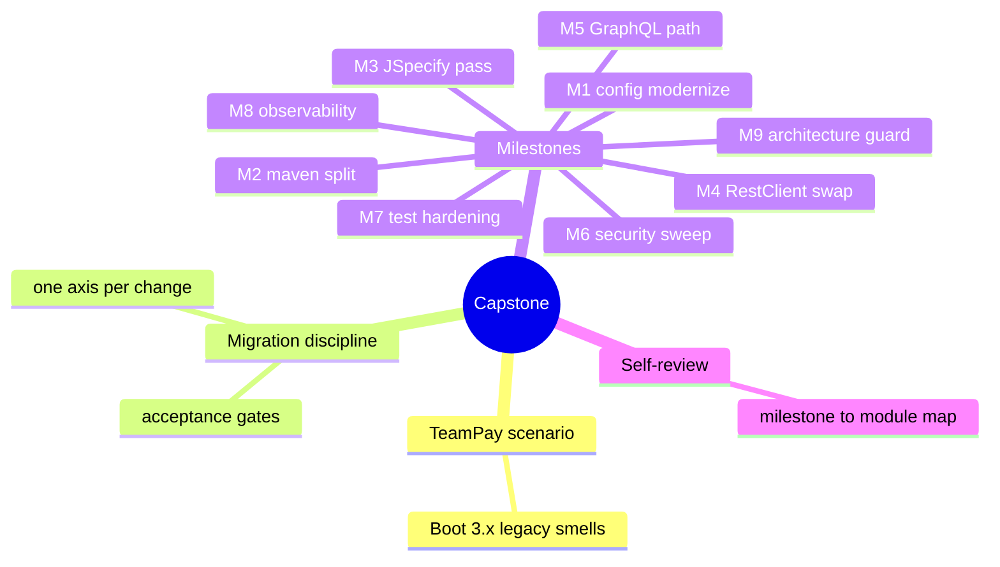

# Module 18: Putting It Together

Est. study time: 1.5h
Language: en
Description: TeamPay refactor capstone. Milestones M1-M9 with observable acceptance gates.

## Knowledge Map

---

## Learning Objectives
- Describe the TeamPay scenario and name the smell each prereq module fixes
- Sequence a Boot 4 upgrade into verifiable milestones using one-axis-per-change discipline
- Write a concrete acceptance criterion per milestone and gate the next on it
- Judge where GraphQL is justified and where REST stays, using error and security patterns
- Run the closing self-review mapping each milestone back to its prereq module

---

## Real-World Example

TeamPay, a payments and trade reference service, runs on Boot 3.x: public-field `@ConfigurationProperties`, a `RestTemplate` to the FX pricing partner, no `@NullMarked`, monolithic controllers, happy-path tests only, untyped `Map` DTOs, one messy package. Auditor flags the Boot 4 deadline. Ticket reads "upgrade TeamPay to Boot 4".

> **Think**: Why is "just bump the version" a trap for a codebase with all those smells?
>
> *Answer: A version bump alone changes nothing about the risk. The smells make the upgrade unsafe - mutable config binding, a deprecated HTTP client, null leaks, no tests. Real job is a guided refactor; the version bump is one milestone inside it.*

---

## Core Content

### Section 1: The TeamPay Scenario

TeamPay is your test patient. Each symptom maps to an earlier module:

| Smell | Legacy shape | Fixing module |
| --- | --- | --- |
| Mutable config | public-field properties, `spring.factories` | 01, 02 |
| Monolithic build | one module, controllers and domain together | 10 |
| Null leaks | no `@NullMarked`, unchecked nulls crossing API | 08 |
| Old HTTP client | `RestTemplate` to FX partner | 16 |
| Untyped DTOs | `Map` JSON hand-built | 07 |
| No GraphQL | fat REST controllers aggregating | 03, 05, 07 |
| Weak security | permissive request matchers | 12 |
| No test coverage | happy-path unit tests only | 13, 14 |
| No observability | plain logs, no tracing | 15 |
| No boundaries | `@Transactional` in controllers, layer mess | 17 |

> **Think**: Two smells share module 07 (MapStruct). Why do untyped DTOs and a GraphQL migration both point at the same module?
>
> *Answer: Both are mapping problems. Hand-built DTO mapping is the smell; MapStruct-generated typed mapping is the fix; GraphQL resolvers need the same discipline.*

### Section 2: One Axis Per Change

Module 02 taught one axis per change: one thing per PR, so every failure names one suspect. TeamPay decomposes into nine milestones - config, build, null-safety, HTTP client, API style, security, tests, observability, architecture - each ending in an acceptance gate. Next milestone waits until the gate is green.

Formula: `risk per release = failure surface ÷ axes changed in that release`

> **Cloze**: "Each TeamPay milestone changes exactly one {axis} - build, null-safety, HTTP client - so a failing gate names one suspect, not nine."
>
> *Answer: axis*

> **Predict**: A stakeholder insists one big PR merge the Boot 4 bump, the Maven split, and the RestClient swap "to save review time."
>
> *Answer: One failure cannot be attributed - version, module layout, or client swap? Rollback is all-or-nothing, each acceptance gate lost. The one-axis rule exists exactly to prevent this.*

> **Spot the Mistake**: A teammate says: "upgrade Boot in the same PR as the architecture split - they're both part of moving to Boot 4."
>
> What's wrong?
>
> *Answer: A version bump and a package split are different axes with different failure modes. Bundled, a modular build break looks like a framework bug and vice versa. Split the PRs so each stays revertible.*

### Section 3: Milestones M1-M4 - Upgrade and Modernize

First four milestones remove structural debt.

**M1 Modernize config (modules 01, 02).** Replace public mutable fields with a private immutable record bound by constructor, add `@ConfigurationPropertiesSource`, delete `spring.factories`. Gate: app starts, properties bean is a record, startup logs show no legacy auto-config warnings.

**M2 Modularize the build (module 10).** Split one Maven module into `api` (interfaces, DTOs, schema) and `impl` (services, controllers, infrastructure). Gate: `mvn clean verify` from root builds `api` then `impl`; `impl` depends only on `api`.

**M3 JSpecify pass (module 08).** Add `package-info.java` with `@NullMarked`, mark `@Nullable` where optional, turn on NullAway. Gate: NullAway green, zero exclusions.

**M4 Swap RestTemplate (module 16).** Replace the FX pricing call with a typed HTTP Service Client interface (`@GetExchange`) backed by `RestClient`. Gate: no `RestTemplate` remains, pricing client is an injected interface.

> **Spot the Mistake**: A dev argues: "skip the JSpecify pass, it's cosmetic - the code works fine without null annotations."
>
> What's wrong?
>
> *Answer: NullAway is a compile-time check. Without `@NullMarked`, a nullable FX response flows into a non-null field and surfaces as a production NPE - exactly when the M4 typed client returns nulls.*

> **Predict**: M2 splits the module but keeps `impl` importing other `impl` packages freely.
>
> *Answer: The split is fake - no real boundary. The M9 Modulith/ArchUnit guard fails, or passes because no rule exists. A split earns its name only when a dependency rule enforces it.*

### Section 4: Milestones M5-M7 - Capabilities and Hardening

**M5 GraphQL migration path (modules 03, 05, 07).** The dashboard query joins trades across four services - a textbook GraphQL aggregation read. Add DGS 12 with Jackson 3, map DTOs with MapStruct, keep REST for CRUD and writes. Gate: the query returns the typed projection, REST CRUD still answers, mapping is MapStruct-generated.

> **Predict**: The team adds GraphQL mutations and schemas for every REST endpoint "so we're fully modern."
>
> *Answer: GraphQL doubles the surface - schema, resolvers, Dataloaders, security mapping - for endpoints that never needed flexible queries. Error and security patterns from 05 and 12 must now hold twice. GraphQL where clients need flexible projections, REST where they do not.*

**M6 Security sweep Security 7 (module 12).** Explicit `authorizeHttpRequests`, CSRF handling for GraphQL mutations, roles per resource. Gate: a POST without CSRF gets the documented 403, chain logs at startup, defaults deny.

**M7 Test hardening (modules 13, 14).** `@WebMvcTest` and `@DataJpaTest` slices, Testcontainers for Postgres and the FX stub, ArchUnit rules for boundaries and transaction ownership. Gate: suite green, slices boot no full context, Testcontainers run in CI, ArchUnit fails on a boundary break.

> **Think**: Why do M5 and M6 come before M7, when tests would catch their bugs?
>
> *Answer: Test coverage is a separate axis. Tests against code replaced next week are wasted work - the M5 DTOs and M6 security chain change the shapes tests assert. Sequence keeps test churn minimal.*

### Section 5: Milestones M8-M9 and Self-Review

**M8 Observability (module 15).** Wire Micrometer Tracing, structured JSON logs, MDC request context. Gate: trace id spans the HTTP call into the DB query, logs parse as JSON, MDC carries the request id.

**M9 Architecture check (module 17).** Enforce transaction boundaries - `@Transactional` only in services - and add a Spring Modulith guard so `api` never depends on `impl`. Gate: guard green, transaction ownership documented, build fails on an illegal dependency.

**Self-review checklist.** Final walk against the Section 1 smell table: M1 config record bound at startup (01, 02); M2 reactor builds api then impl (10); M3 NullAway green (08); M4 no RestTemplate, typed interface (16); M5 typed dashboard query, REST intact (03, 05, 07); M6 CSRF 403 documented, explicit grants (12); M7 slices, Testcontainers, ArchUnit green (13, 14); M8 trace ids, JSON logs, MDC (15); M9 Modulith guard green, tx in services (17).

```mermaid
flowchart LR
  L0[TeamPay Boot 3.x] --> M1
  M1[Modernize config] --> G1{gate config record}
  G1 --> M2[Split Maven modules]
  M2 --> G2{gate reactor green}
  G2 --> M3[JSpecify and NullAway]
  M3 --> G3{gate NullAway green}
  G3 --> M4[RestClient swap]
  M4 --> G4{gate no RestTemplate}
  G4 --> M5[GraphQL path]
  M5 --> G5{gate REST intact}
  G5 --> M6[Security sweep]
  M6 --> G6{gate CSRF 403}
  G6 --> M7[Test hardening]
  M7 --> G7{gate suite green}
  G7 --> M8[Observability]
  M8 --> G8{gate JSON logs}
  G8 --> M9[Architecture guard]
  M9 --> Done[TeamPay Boot 4]
```

> **Cloze**: "M9 uses a Spring {Modulith} guard so api never depends on impl and transactions live in services."
>
> *Answer: Modulith*

> **Think**: Your team finishes M1-M9 but skips the self-review checklist. What breaks?
>
> *Answer: Gates prove each milestone in isolation; the checklist forces the cross-check - config record still bound, tests green against final DTOs, security still on GraphQL routes. Skipping it lets drift sneak in.*

---

### Why This Matters

Every earlier module taught a pattern in isolation. Real upgrades fail where patterns meet: the null-safe API returns data through a new client into a changed DTO, behind new security rules, under a modular build. The capstone turns the course into one decision sequence - wrong ordering makes milestones fight; right gates catch failures at their own doorstep.

---

## Key Takeaways
- Every legacy smell maps to a prerequisite module; the capstone applies them in order
- One axis per change keeps each PR revertible and each failure attributable
- An acceptance gate must be observable - startup logs, build output, a 403 - before the next milestone
- GraphQL for aggregating reads, REST where the contract is simple
- Self-review maps each milestone to its module and catches drift isolated gates miss

---

## Common Misconception

"Capstone means building something new with all the fancy patterns." Wrong. The capstone is a guided refactor: most of the work is deleting legacy code and proving behavior stayed the same. New code appears only where a pattern replaces an old one - a record for the config class, an interface for the client. Inventing features means you left the exercise.
---

## Spot the Mistake

A team runs M3 (JSpecify) before M2 (module split), then finds NullAway errors scattered across a package M2 will re-organize anyway.

What's wrong?

*Answer: M2 changes package and module layout, so the `@NullMarked` declarations written in M3 must be reworked against the new structure. Ordering matters - do structural moves first so annotation work lands once.*

---

## Feynman Explain

Teach a child: "Your toy room is messy. You are not buying new toys. Move the cars to one shelf, label it so no toy leaves, fix the one toy that falls apart, then check the rule book. Move one shelf at a time - if something breaks you know exactly which shelf you touched." No jargon - no axes, milestones, gates.

---

## Reframe

Judge: is M1-first right, or could a team honestly start elsewhere? Zero-test teams might argue M7 first - prove current behavior before touching anything. Counterargument: M7 against legacy shapes is throwaway when M4 and M5 change those shapes anyway. When is it smarter to break the sequence? Write your evaluation.

---

## Drill
Take the quiz, then the cumulative quiz to see TeamPay across all modules: `learn.sh quiz spring-boot 18-putting-together`, `learn.sh review spring-boot`, `learn.sh cumulative-quiz spring-boot`.
